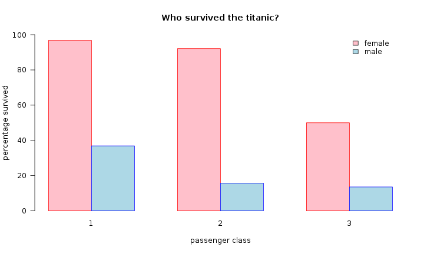

# Challenge 

Based on what you have learnt so far in this chapter, here is a challenge to test your plot-ruining capabilities.

 

--- 

**Table of Contents**

<!-- toc -->

 

---

## Plotting challenge

Your challenge is to modify the code in [this file](plottingChallenge.R), to create the ugliest plot possible. Refer to the [context](context#context) section for a description of the code and how to modify it.

<!--sec data-title="Example of a pretty plot" data-id="tip1" data-show=true data-collapse=true ces-->

~~~sourcecode
par(bg = "white")
barplot(percentageSurvival, 
        beside = TRUE, 
        col = c("pink", "lightblue"),
        border = c("red", "blue"),
        legend = TRUE, 
        args.legend = list(bty = "n", y = 100, x = 9), 
        ylim = c(0, 100),  
        xlab = "passenger class", 
        ylab = "percentage survived", 
        main = "Who survived the titanic?")
~~~

<!--endsec-->

 

---

## Plotting parameters 

Below is a list of plotting parameters that you may consider modifying for this challenge (don't forget to add a comma before each additional argument):

* `space = c(0, 1)` 
  
  change the numbers to change the spacing between bars

* `legend = TRUE`  

  add a legend

* `beside = TRUE`  	

  change to FALSE to create a stacked plot

* `density = 10`       	

  add shading lines of the density in lines per inch indicated by the number

* `col = "colour"`     	

  change the colour of the bars by adding a real colour name between the quotation marks (to add more than one colour, use: c("colour1", "colour2"))

* `border = "colour"`  

  change the colour of the border of the bars by adding a real colour name between the quotation marks

* `col.axis = "colour"`

 change the colour to be used for axis annotation by adding a real colour name between the quotation marks

* `col.lab = "colour"`

 change the colour of the x and y-axis labels by adding a real colour name between the quotation marks

* `col.main = "colour"`

 change the colour of the plot title by adding a real colour name between the quotation marks

* `main = "title"`       	

 add a title to the plot by changing the text between the quotation marks

* `xlab = "label"`      	

 add a title to the x-axis by changing the text between the quotation marks

* `ylab = "label"`      	

 add a title to the y-axis by changing the text between the quotation marks

* `axes = TRUE`     	

 change to FALSE to stop R from drawing axes

* `cex.axis = 1`        	

 change the number to change the size of the numeric axis labels

* `cex.names = 1`  	

 change the number to change the size of the bar names

* `cex.main = 1`      	

 change the number to change the size of the plot title

* `lwd = 1`                	

 change the number to change the line width

* `axis.lty = 1`          

 change the number to change the line type of the axis (0 - 6)

* `font.axis = 1`       	

 change the number to change the font style used for the axis annotation

* `font.lab = 1`         	

 change the number to change the font style used for the x and y-axis labels

* `font.main = 1`     	

 change the number to change the font style for the plot title

* `las = 1`                

 change the number to change the direction of axis annotation (0, 1, 2 or 3)

* `tck = 0.01`       	

 change the number to change the length of the tick marks

* `par(bg = "colour")` 

 change the colour of the background by adding a real colour name between the quotation marks
